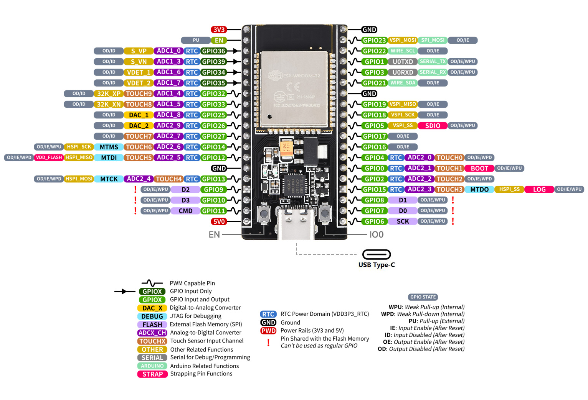

Microcontoller
- [Seeit ESP32-DEV-38P](https://no.rs-online.com/web/p/microcontroller-development-tools/2863991)
  - Their datasheet does not give much information. This pinout *should* be correct.

Relay
- [Power Relay](https://no.rs-online.com/web/p/power-relays/2826640)

Jumper Wires
- [M-M Jumper Wire](https://no.rs-online.com/web/p/breadboard-jumper-wires/2048241)
- [F-M Jumper Wire](https://no.rs-online.com/web/p/breadboard-jumper-wires/2048243)

Moisture Sensors
- [Capacitive Moisture Sensor](https://no.rs-online.com/web/p/sensor-development-tools/2049892)
- [Resistive Moisture Sensor](https://no.rs-online.com/web/p/arduino-compatible-boards-kits/2163778)

Boards
- [Breadboard](https://no.rs-online.com/web/p/breadboards/2153175)
- [Soldering Breadboard / Perfboard](https://www.digikey.no/no/products/detail/chip-quik-inc/SBBTH127P/9835209?_gl=1*1r2hq72*_up*MQ..*_gs*MQ..&gclsrc=aw.ds)

Pump
- [3VDC Pump](https://www.digikey.no/no/products/detail/adafruit-industries-llc/4546/11627740?_gl=1*em5iti*_up*MQ..*_gs*MQ..&gclsrc=aw.ds)

Extra stuff
- [Mosfet](https://www.digikey.no/no/products/detail/infineon-technologies/IRLZ44NPBF/811808?s=N4IgTCBcDaIJICUAyAtALGgcgBQEIDEBaTAERAF0BfIA)
- [Diode](https://www.digikey.no/no/products/detail/diotec-semiconductor/1N4001/13164614)
- [Servo Motor](https://www.digikey.no/no/products/detail/dfrobot/SER0006/7597224)
- [Gearmotor](https://www.digikey.no/no/products/detail/adafruit-industries-llc/3777/8687221)
